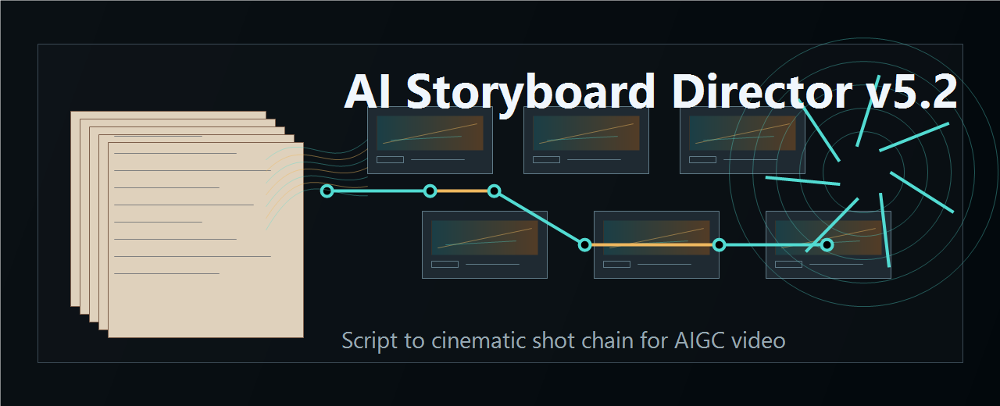
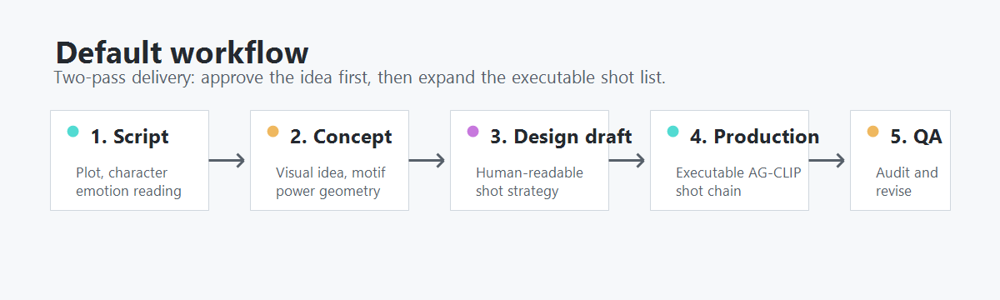
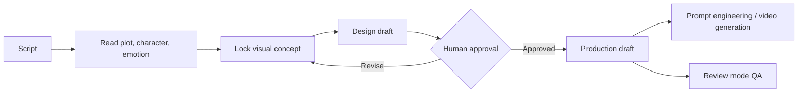

<p align="center">
  
</p>

<h1 align="center">AI Storyboard Director v5.2</h1>

<p align="center">
  Director-grade AIGC storyboard skill for turning scripts into executable shot chains.
</p>

<p align="center">
  <a href="LICENSE"></a>
  
  
  
</p>

AI Storyboard Director v5.2 是一个面向 AIGC 视频创作的导演级分镜技能。它不是把剧本文字机械切段，而是先读懂剧情、人物、情绪和视觉概念，再生成可审查、可修改、可交给下游视频生成工具执行的镜头链。

适合短片、短剧、广告片、概念片、影视预演，以及“剧本 → 分镜 → 提示词 → 视频”的 Agent 自动化工作流。

## Why This Exists

很多“剧本转分镜”提示词会把自然段、台词行或剧情动作直接切成镜头，结果常见三类问题：

- **像导播，不像导演**：开场远景、对话过肩互切、情绪切特写，整套方案谁来做都一样。
- **看起来完整，下游难用**：有情绪形容和导演散文，但缺少可生成的物理事实。
- **局部合格，整章平庸**：每个镜头都没错，连起来没有视觉主意、母题演变和剪辑节奏。

v5.2 的核心修正是“导演脑前置”：先锁定本章视觉概念，再拆镜头。输出时保留结构化决策痕迹，但不把散文思考塞进生产稿。

## What It Does

- **Script reading**：按情节、人物、情绪三层理解剧本。
- **Destination-first design**：先设计观众最终带走的信息/情绪，再倒推镜头路径。
- **Visual concept lock**：强制定义视觉概念、母题、空间权力几何、反常规决定和风格坐标。
- **Two-pass delivery**：默认先出设计稿给人拍板，再展开生产稿给机器执行。
- **AG-CLIP shot chain**：每个镜头是一个连续 take，镜头之间用受控剪辑动机连接。
- **AIGC-safe output**：生产稿只保留可拍、可生成、可校验的物理事实。
- **Review mode**：可审查已有分镜，定位连续性、导播病、不可生成描述和原文搬运等问题。

<p align="center">
  
</p>

## Choose Your File

| File | Best for | How to use |
|---|---|---|
| [`ai-storyboard-director5.2.skill`](ai-storyboard-director5.2/ai-storyboard-director5.2.skill) | Codex / Agent environments that support skill packages | Import the skill package, then send a script and ask for storyboard splitting |
| [`ai-storyboard-director5.2-全量单文件.md`](ai-storyboard-director5.2/ai-storyboard-director5.2-%E5%85%A8%E9%87%8F%E5%8D%95%E6%96%87%E4%BB%B6.md) | Long-context models and full-depth reasoning | Paste the whole file as system prompt or first message |
| [`ai-storyboard-director5.2-精编单文件.md`](ai-storyboard-director5.2/ai-storyboard-director5.2-%E7%B2%BE%E7%BC%96%E5%8D%95%E6%96%87%E4%BB%B6.md) | Smaller-context models and fast runs | Paste the compact file as system prompt or first message |

## Quick Start

### 1. Use the full standalone version

Open [`ai-storyboard-director5.2-全量单文件.md`](ai-storyboard-director5.2/ai-storyboard-director5.2-%E5%85%A8%E9%87%8F%E5%8D%95%E6%96%87%E4%BB%B6.md), copy the whole content into your model as the system prompt, then send:

```text
下面是剧本。请先按 v5.2 默认流程输出设计稿，等我确认后再展开生产稿。

<粘贴你的剧本>
```

### 2. Use the compact version

For a smaller model or a fast draft, use [`ai-storyboard-director5.2-精编单文件.md`](ai-storyboard-director5.2/ai-storyboard-director5.2-%E7%B2%BE%E7%BC%96%E5%8D%95%E6%96%87%E4%BB%B6.md):

```text
使用精编版规则拆分镜。先给设计稿，镜头表保持简洁。

<粘贴你的剧本>
```

### 3. Use review mode

Send an existing storyboard and ask:

```text
请进入审查模式，检查这份分镜是否存在导播病、连续性问题、不可生成描述和输出契约缺漏，并给出修正版。
```

## Output Modes

| Mode | Reader | Purpose |
|---|---|---|
| Design draft | Human | See the idea quickly: concept, motif, spatial strategy, thin shot table |
| Production draft | Machine / downstream agent | Full structured AG-CLIP shot list with physical facts and continuity anchors |
| Review report | Creator / editor | Diagnose and repair an existing storyboard |

## Example Workflow



## Repository Structure

```text
.
├── README.md
├── LICENSE
├── assets/
│   ├── ai-storyboard-director-banner.png
│   └── workflow.png
└── ai-storyboard-director5.2/
    ├── README.md
    ├── ai-storyboard-director5.2.skill
    ├── ai-storyboard-director5.2-全量单文件.md
    └── ai-storyboard-director5.2-精编单文件.md
```

## Design Principles

- **Director first, operator second**：先判断“这一章作为画面是什么主意”，再拆镜头。
- **Physical facts over prose**：生产稿拒绝比喻和情绪散文，保留下游能执行的可见事实。
- **Continuity by contract**：入口引用、出口状态、锚点和剪辑动机让镜头链可审查。
- **Creative ceiling + safety floor**：铁律和自检防错，概念层防平庸。

## License

MIT License. You can use, copy, modify, distribute, and build on this project, as long as the license notice is preserved.
